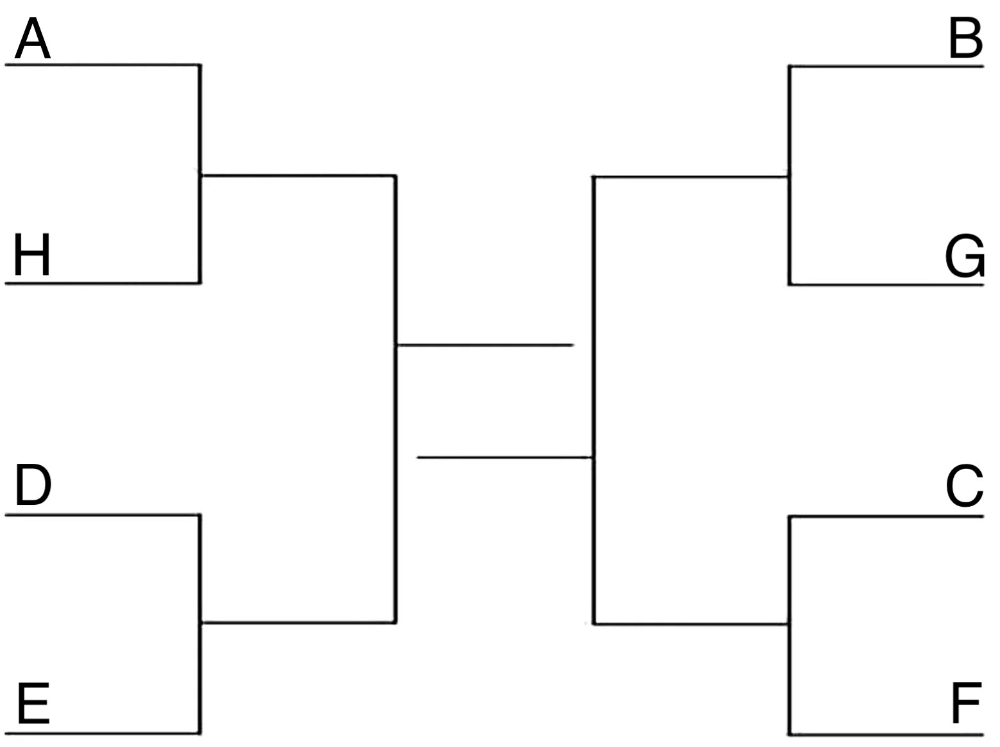

---
header-includes:
  - \usepackage{fullpage}
  - \pagenumbering{gobble}
output:
  pdf_document:
---

```{r setup, include=FALSE}
knitr::opts_chunk$set(echo = TRUE)
library("xtable")
```

Goal: Maximize the expected score of a bracket. 

## Tournament Structure

Consider the following bracket for an 8-team, single elimination tournament. 

{width=50%}

Questions:

- How many unique brackets are there?

## Head-to-head Probabilities

Suppose the following table provides the probability that the row team beats 
the column team. 
For example, the probability that Team A beats Team H is 0.85. 

```{r probabilities, echo = FALSE, results='asis'}
p <- rbind(
  seq(0.50, by = 0.05, length = 8),
  seq(0.45, by = 0.05, length = 8),
  seq(0.40, by = 0.05, length = 8),
  seq(0.35, by = 0.05, length = 8),
  seq(0.30, by = 0.05, length = 8),
  seq(0.25, by = 0.05, length = 8),
  seq(0.20, by = 0.05, length = 8),
  seq(0.15, by = 0.05, length = 8)
)

# Make non-transitive
p[1, 7] <- 0.45

# Ensure probabilities sum to 1
for (r in 2:nrow(p)) {
  for (c in 1:r) {
    p[c, r] <- 1 - p[r, c]
  }
}


diag(p) <- NA
colnames(p) <- 
  rownames(p) <- LETTERS[1:8]


p |>
  xtable::xtable(
    caption = "Probabilities for the row team to beat the column team."
  ) |>
  xtable::print.xtable(
    caption.placement="top",
    comment=FALSE)
```

Question:

- Are the probabilities that one team beats another team transitive? How can you tell?

\newpage
## Team-Round Probabilities

Use this table of probabilities and the tournament structure above to complete 
the table below. 
This table contains the probabilities for each team to reach the indicated
round with the first round having a probability of 1. 

\large
```{r round-probabilities, echo=FALSE, results = 'asis'}
round_probabilities <- data.frame(
  Team = LETTERS[1:8],
  `Round 2 (Semi-Finals)` = NA,
  `Round 3 (Championship)` = NA,
  `Round 4 (Champion)` = NA,
  check.names = FALSE
) |>
  xtable::xtable(
    caption = "Probabilities for a team to reach a specific round.",
    align = "c|c|c|c|c|"
  ) |>
  xtable::print.xtable(
    include.rownames = FALSE,
    hline.after = seq(-1, 8),
    caption.placement = "top",
    comment = FALSE
  )
```
\normalsize

Questions:

- How can we check these probabilities?

## Expected Score

Choose any possible tournament outcome and call this your bracket.
Your goal is to pick the bracket with the highest expected score that nobody
else picks. 

\large
```{r bracket, echo=FALSE, results='asis'}
data.frame(
  Game = c(paste0("Round 1 winner: ", 
                  c("A,H", "D,E", "B,G", "C,F")), 
           paste0("Semi-winner: ",
                  c("A,H,D,E", "B,G,C,F")),
           "Champion", "Total"),
  Points = c(rep(1,4), rep(2,2), 4, NA),
  Choice = "",
  Probability = "",
  `Expected Points` = "",
  check.names = FALSE
) |>
  xtable(
    caption = "Choose your bracket. Calculate its probability and expected points.\\\\",
    align   = "l|l|c|c|c|c|",
    digits  = 0
  ) |>
  print.xtable(
    include.rownames = FALSE,
    hline.after = seq(-1, 8),
    caption.placement = "top",
    comment = FALSE
  )
```
\normalsize

**Calculate the probability of this bracket** 
by multiplying all the independent probabilities.

Suppose a prediction competition awards 
1 point  for each team correctly chosen to reach the semi-finals, 
2 points for each team correctly chosen to reach the championship, and
4 points for the  team correctly chosen as champion. 
**Calculate the expected number of points your bracket** will earn.
Recall that an *expectation* is the value of the random variable multiplied
by its probability. 
Thus, the expected score can be computed by multiplying the points awarded for 
a correct team-round prediction times the probability that the team-round 
combination will occur and adding up all of these values. 

Questions:

- How would your expected score change if the scoring was different, e.g. round times seed?
- How can we find the bracket that will maximize the expected score especially if the scoring is complicated?


